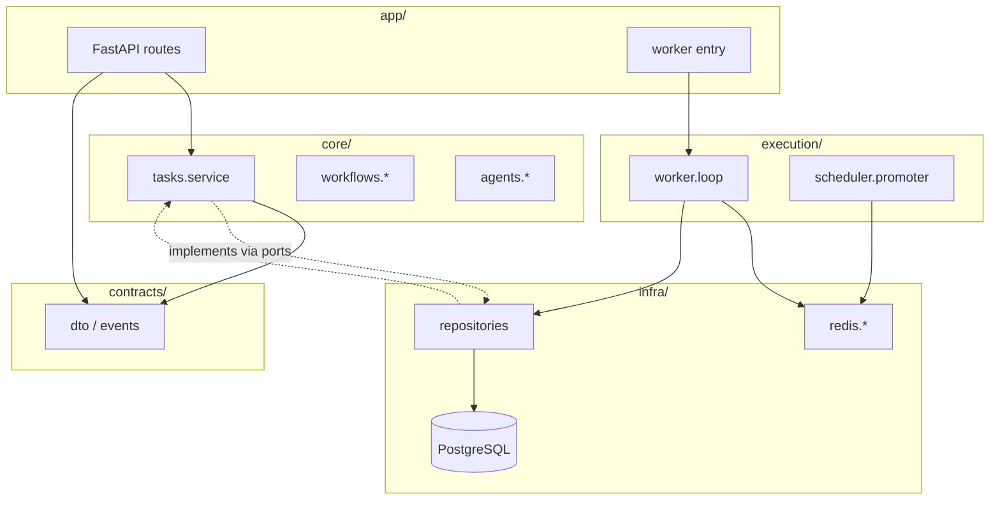

# Agent Execution Cloud — Architecture

This document defines **ownership**, **import rules**, and **how the modular layout prevents drift** as the org scales (10 → 100+ engineers).

## 1. Folder structure (canonical)

```
agent_cloud/
├── app/                    # HTTP & process entrypoints ONLY (thin)
│   ├── api/
│   │   ├── main.py         # FastAPI factory
│   │   └── v1/
│   │       ├── deps.py
│   │       ├── router.py
│   │       └── routes/     # Route modules → call core services
│   ├── workers/            # Worker/scheduler entrypoints (parse env, call execution/)
│   └── cli/
├── core/                   # Domain: NO FastAPI, SQLAlchemy, Redis clients
│   ├── tasks/
│   ├── workflows/
│   ├── agents/
│   ├── rate_limit/
│   └── security/           # Pure validation / policy (not HTTP middleware)
├── infra/                  # All I/O: DB ORM, Redis, HTTP, settings
│   ├── db/
│   ├── redis/
│   ├── external/
│   └── config/
├── execution/              # Worker engine: loops, retry, recovery (no HTTP)
│   ├── worker/
│   └── scheduler/
├── contracts/              # DTOs, API shapes, event payloads (shared vocabulary)
├── tests/
├── scripts/
```

Docker assets: repository root `Dockerfile.api`, `Dockerfile.worker`, `docker-compose.yml` (and `agent_cloud/docker/` README for multi-stage patterns).

## 2. Import flow (diagram)



**Allowed edges:** `app → core`, `app → contracts`, `core → contracts`, `infra → contracts` (types only), `execution → infra`, `execution → contracts`, `app → infra` (wiring only).

**Not allowed:** `infra → app`, `core → app`, `core → infra` (core uses **ports**; infra **implements** ports at startup).

## 3. Why this structure reduces bugs

| Risk | How the layout helps |
|------|----------------------|
| Business logic in controllers | Routes only validate/translate HTTP → DTO → `core` services. |
| Duplicate queue/DB rules | Single `core/tasks/service.py` + one `TaskRepository` in `infra`. |
| ORM leaking into API | ORM stays in `infra/db`; API sees DTOs / domain models from `contracts` / `core`. |
| Circular imports | Dependency rule is one-way; `contracts` has no upstream deps. |
| Untestable workers | `core` and `execution` tested without FastAPI; repos mocked via ports. |
| Schema drift | `contracts` versioned; OpenAPI generated from same types as internal DTOs. |

## 4. Validation checklist

- [ ] No business rules in `app/api` beyond auth and HTTP concerns.
- [ ] No SQLAlchemy or raw SQL in `core/`.
- [ ] No Redis client usage in `core/` (inject queue/port from `infra` in `app` or factory).
- [ ] Workers start from `app/workers/*` only; loops live in `execution/`.
- [ ] New HTTP surface → `app/api/v1/routes/`; new tables → `infra/db/` + Alembic.

## 5. Naming note: two `execution` trees

The repository currently has **`execution/`** at the repo root (backoff, recovery helpers) and **`agent_cloud/execution/`** (worker/scheduler package). Imports use **`agent_cloud.execution.*`** for the new layer and **`execution.backoff`** for the legacy helper package until the root folder is renamed (e.g. to `runtime_support/`) in a dedicated refactor.

## 6. Scaling notes

- **Multiple worker types:** `app/workers/gpu_worker.py` → different `execution/worker/executor.py` bindings.
- **Multi-region:** `infra/redis/queues.py` namespaced keys; region in `infra/config`.
- **Plugins:** `core/agents/registry.py` loads entry points; sandbox in `core/agents/sandbox.py` + `infra` for process/docker.

## 7. See also

- **`docs/PRODUCTION_ARCHITECTURE.md`** — Postgres + Redis + API + workers diagram, env flags, deployment summary.
- **`workers/guaranteed_loop.py`** — reference loop with structured logs, `task_events`, idempotency gate, token-bucket-friendly metrics (alongside `workers/execution_worker.py` and `workers/worker.py`).
