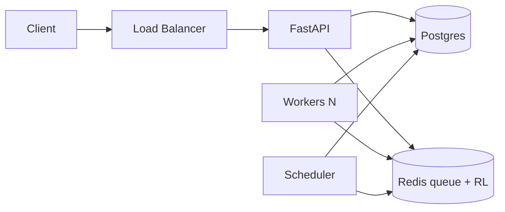

# Agent Execution Cloud — Production Architecture

This document ties together **Postgres (source of truth)**, **Redis (queue + locks + rate limits)**, **API (validation + policy)**, and **workers (execution + recovery)**.

## Text diagram

```
                         ┌─────────────────────────────────────────┐
                         │           Load Balancer (TLS)            │
                         └────────────────────┬──────────────────────┘
                                              │
┌─────────────────────────────────────────────▼────────────────────────────────┐
│  FastAPI                                                                      │
│  • Pydantic validation  • JWT / project headers                             │
│  • TraceContext (X-Request-ID)  • Sliding-window RL  • Token-bucket RL      │
│  • Body limits  • SSRF policy on outbound fetchers                          │
└───────────────┬───────────────────────────────────────────────┬──────────────┘
                │ insert task (UUID)                             │
                ▼                                                │
┌───────────────────────────┐         ┌─────────────────────────▼────────────┐
│  Postgres                  │         │  Redis                                  │
│  • tasks (status, hb)      │         │  LIST queue:ready / BRPOP              │
│  • task_events (append)    │         │  ZSET visibility (processing)          │
│  • task_idempotency        │         │  SETNX execution locks                 │
│  • dead_letter_queue       │         │  rate:{jwt_sub} token bucket           │
│  • results / checkpoints   │         │  api_rl:v1:* sliding window            │
└───────────────┬────────────┘         └─────────────────────────┬────────────┘
                │ atomic claim                                      │
                │ UPDATE … WHERE status ∈ {pending,queued,retry}    │
                ▼                                                   │
┌───────────────────────────────────────────────────────────────────────────────┐
│  Workers (horizontal)                                                          │
│  execution_worker / guaranteed_loop / legacy worker.py                         │
│  BRPOP → SETNX lock → claim_task_running → ZADD processing (deadline)        │
│  → idempotency try_claim → execute (sandbox / circuit breaker) → PG result   │
│  → task_events + JSON logs + metrics                                           │
└───────────────────────────────────────────────────────────────────────────────┘
                │ heartbeats / scheduler recovery
                ▼
┌───────────────────────────┐
│  Scheduler process         │  stalled running → reset + re-enqueue (app rules)│
└───────────────────────────┘
```

## Mermaid (optional)



## Core modules

| Concern | Location |
|--------|----------|
| Reference worker loop | `workers/execution_worker.py` |
| Observable + idempotency + metrics | `workers/guaranteed_loop.py` |
| Task claim | `database/db.py` → `claim_task_for_worker` |
| Queue + visibility | `redis_queue_pkg/redis_queue.py` |
| Locks | `redis_queue_pkg/locks.py` |
| Idempotency | `database/task_idempotency.py` |
| Task events | `agent_cloud/infra/db/task_events_repo.py` |
| JSON logs + metrics | `agent_cloud/infra/observability/` |
| Token bucket | `agent_cloud/infra/redis/token_bucket.py` |
| API token bucket | `api/middleware/token_bucket_rate_limit.py` (`ENABLE_TOKEN_BUCKET=1`) |
| Trace | `api/middleware/trace_context.py` |
| Circuit breaker | `agent_cloud/core/resilience/circuit_breaker.py` |

## Deployment (summary)

1. **Postgres**: managed HA, PITR backups, migrations via Alembic at boot (`assert_migrations_applied`).
2. **Redis**: managed with persistence / failover; queue keys documented under `redis_queue_pkg`.
3. **API**: N replicas behind LB; scale on CPU/latency; set `REDIS_URL`, `DATABASE_URL`, JWT issuer secrets.
4. **Workers**: stateless replicas; `WORKER_ID` unique per process; scale on queue depth / `tasks_running`.
5. **Scheduler**: single leader or distributed lock (extend `workers/scheduler_runner.py` for HA).

## Environment flags

| Variable | Purpose |
|----------|---------|
| `ENABLE_TOKEN_BUCKET` | `1` / `true` — per-user `rate:{sub}` token bucket |
| `TOKEN_BUCKET_CAPACITY` | Burst tokens (default 60) |
| `TOKEN_BUCKET_REFILL_PER_SEC` | Steady-state refill (default 1) |
| `VISIBILITY_TIMEOUT_SEC` | Processing lease in Redis ZSET |
| `LOCK_TTL_SEC` | Redis execution lock TTL |
| `EXEC_CB_FAILURES` / `EXEC_CB_COOLDOWN_SEC` | Executor circuit breaker (`guaranteed_loop`) |

## Validation checklist (operator)

- [ ] Tasks are persisted before Redis enqueue (Postgres first).
- [ ] Workers use atomic claim + visibility timeout + lock.
- [ ] Idempotency prevents duplicate side effects for the same logical key.
- [ ] DLQ + retries wired for orchestration paths (`workers/worker.py`).
- [ ] Structured logs include `trace_id` / `task_id` where applicable.
- [ ] Rate limits + SSRF policies enabled in production configs.
